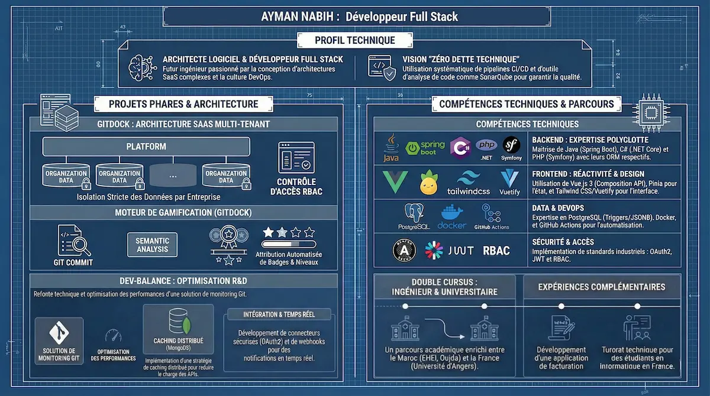

  
<h1>Salut, je suis Ayman NABIH 👋</h1>

<h3>Élève Ingénieur en Génie Informatique | Architecte Logiciel Junior | Full Stack</h3>

<em>"Concevoir des solutions résilientes avec une approche DevOps moderne, en visant toujours la <b>dette technique zéro</b>."</em>

 

## 🚀 Mon Profil en Bref

Je suis un développeur passionné par l'architecture logicielle, évoluant à la croisée d'un Backend robuste, de bases de données optimisées et d'interfaces réactives.

- 🔭 **Actuellement :** Je conçois *from scratch* une architecture SaaS multi-tenant complexe.
- 💡 **Ma spécialité :** Créer des architectures résilientes (Micro-services, Pattern Strategy) et optimiser les performances sous forte charge (Caching distribué, requêtes SQL complexes).
- 🌱 **En cours d'exploration :** Systèmes RAG (Retrieval-Augmented Generation), Modèles prédictifs (Python) et IA Agentique appliqués au Génie Logiciel.

---

## 🧠 Ma Philosophie d'Ingénierie

> **Clean Architecture & Scalabilité :** Je ne me contente pas de faire fonctionner le code ; je m'assure qu'il soit maintenable, testable et prêt à évoluer. De la modélisation de la base de données à la livraison continue, chaque étape est pensée pour minimiser la friction technique.

---

## 💻 Stack Technique & Outils

<table>
<tr>
<td align="center" colspan="3"><b>⚙️ Backend & Architecture</b></td>
<td align="center"><b>🎨 Frontend</b></td>
<td align="center" colspan="2"><b>☁️ Data & DevOps</b></td>
</tr>
<tr>
<td align="center" valign="top" width="16%">
<b>☕ Java</b>

  
  
  
  

</td>
<td align="center" valign="top" width="16%">
<b>🔷 .NET</b>

  
  
  

</td>
<td align="center" valign="top" width="16%">
<b>🐘 PHP</b>

  
  
  

</td>
<td align="center" valign="top" width="16%">
<b>⚙️ Frontend</b>

  
  
  
</td>
<td align="center" valign="top" width="16%">
<b>🗄️ Databases</b>

  

</td>
<td align="center" valign="top" width="16%">
<b>☁️ Infra</b>

  
  

</td>
</tr>
</table>

---

## 🏆 Projets Phares

### 🚢 [GitDock] *(Projet de Fin d'Année)*
> **Plateforme SaaS d'analyse Git multi-tenant** conçue pour centraliser la productivité des équipes de développement.

* 🏗️ **Architecture :** Conception d'un système isolant les données par entreprise (Multi-tenant) avec sécurisation stricte via JWT et OAuth2.
* 🗄️ **Data Engineering :** Implémentation de Triggers SQL complexes sous PostgreSQL pour garantir l'intégrité financière et analytique en temps réel.
* 🎮 **Gamification Engine :** Développement d'un moteur d'attribution automatique de badges basé sur l'analyse sémantique des tags de commits.

### 🔧 Dev-Balance *(Stage - SII Services Maroc)*
> **Solution de monitoring Git :** Maintenance évolutive et refonte technique majeure pour améliorer l'expérience utilisateur et les performances.

* 🔄 **Refactoring Architectural :** Migration complexe d'une relation "Many-to-One" vers "Many-to-Many" pour permettre une collaboration multi-acteurs sur un même dépôt.
* ⚡ **Performance :** Déploiement d'une stratégie de caching distribué avec MongoDB pour soulager l'API des traitements de JSONs volumineux.
* 📡 **Temps Réel :** Mise en place d'une architecture événementielle avec Webhooks et notifications instantanées via WebSockets.

---

<i>Prêt à relever de nouveaux défis architecturaux. N'hésitez pas à jeter un œil à mes dépôts ci-dessous ! 👇</i>

