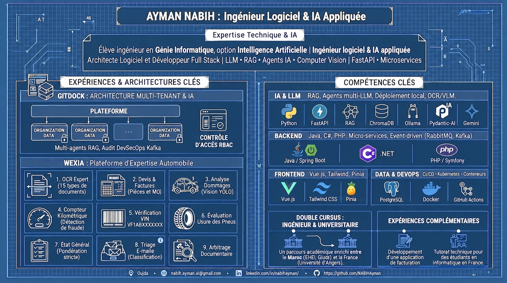

<h1>Salut, je suis Ayman NABIH 👋</h1>

<h3>Élève Ingénieur en Génie Informatique, option Intelligence Artificielle | Architecte Logiciel Junior | Full Stack</h3>

<em>"Concevoir des solutions résilientes avec une approche DevOps moderne, en visant une <b>dette technique minimale</b>."</em>

 

## 🚀 Mon Profil en Bref

Élève ingénieur en option **Intelligence Artificielle**, je suis un développeur passionné par l'architecture logicielle, évoluant à la croisée d'un Backend robuste, de bases de données optimisées et d'interfaces réactives, et j'y intègre l'IA (RAG, agents LLM, OCR/VLM) au service de processus métier réels.

- 🔭 **Actuellement :** Stagiaire Ingénieur IA & Backend : agents IA spécialisés, benchmark de modèles OCR/VLM sur données de production et service d'extraction documentaire (FastAPI) déployé sur Linux.
- 💡 **Ma spécialité :** Créer des architectures résilientes (Micro-services, Pattern Strategy) et optimiser les performances sous forte charge (Caching distribué, requêtes SQL complexes).
- 🌱 **IA appliquée :** Systèmes RAG, agents multi-LLM (Pydantic-AI), modèles OCR/VLM et connecteurs MCP, avec un principe : l'IA lit, le code décide.

---

## 🧠 Ma Philosophie d'Ingénierie

> **Clean Architecture & Scalabilité :** Je ne me contente pas de faire fonctionner le code ; je m'assure qu'il soit maintenable, testable et prêt à évoluer. De la modélisation de la base de données à la livraison continue, chaque étape est pensée pour minimiser la friction technique.

---

## 💻 Stack Technique & Outils

<table>
<tr>
<td align="center"><b>🤖 IA & Machine Learning</b></td>
</tr>
<tr>
<td align="center">

</td>
</tr>
</table>

<table>
<tr>
<td align="center" colspan="3"><b>⚙️ Backend & Architecture</b></td>
<td align="center"><b>🎨 Frontend</b></td>
<td align="center" colspan="2"><b>☁️ Data & DevOps</b></td>
</tr>
<tr>
<td align="center" valign="top" width="16%">
<b>☕ Java</b>

  
  
  
  

</td>
<td align="center" valign="top" width="16%">
<b>🔷 .NET</b>

  
  
  

</td>
<td align="center" valign="top" width="16%">
<b>🐘 PHP</b>

  
  
  

</td>
<td align="center" valign="top" width="16%">
<b>⚙️ Frontend</b>

  
  
  

</td>
<td align="center" valign="top" width="16%">
<b>🗄️ Databases</b>

  
  
  
  

</td>
<td align="center" valign="top" width="16%">
<b>☁️ Infra</b>

  
  
  
  
  

</td>
</tr>
</table>

---

## 🏆 Projets Phares

### 🚢 GitDock *(Projet de Fin d'Année — équipe de 4, responsable backend & IA — projet académique, jamais mis en production)*
> **Plateforme SaaS d'analyse Git multi-tenant** conçue pour centraliser la productivité des équipes de développement.

* 🏗️ **Architecture :** Conception d'un système isolant les données par entreprise (Multi-tenant) avec sécurisation stricte via JWT et OAuth2.
* 🧩 **Micro-services :** 8+ services polyglottes (Spring Boot, Symfony, .NET, FastAPI), API Gateway, Eureka, RabbitMQ, Kafka, pattern Saga, Resilience4j.
* 🤖 **gitdock-yam :** Assistant multi-agents RAG (routeur sémantique puis agents spécialisés), profils développeurs vectorisés dans ChromaDB, cascade LLM Ollama local puis Gemini.
* 🛡️ **gitdock-sentinel :** Audit DevSecOps des diffs de commits en temps réel (Kafka, analyse LLM, diffusion WebSocket).

### 🧠 Assistant Cognitif V2 *(Projet personnel)*
> **Captures d'écran → base de connaissances Markdown** via un VLM local, avec validation humaine.

* ⚙️ **Stack :** Vue 3, FastAPI, Pydantic-AI ; traitement par lots asynchrone et notifications WebSocket.
* 🔌 **Intégration :** Connecteur MCP (FastMCP) vers Notion ; Docker Compose 3 services derrière un reverse proxy Nginx.

### 🔧 Dev-Balance *(Stage - SII Services Maroc)*
> **Solution de monitoring Git :** Maintenance évolutive et refonte technique majeure pour améliorer l'expérience utilisateur et les performances.

* 🔄 **Refactoring Architectural :** Migration complexe d'une relation "Many-to-One" vers "Many-to-Many" pour permettre une collaboration multi-acteurs sur un même dépôt.
* ⚡ **Performance :** Déploiement d'une stratégie de caching distribué avec MongoDB pour soulager l'API des traitements de JSONs volumineux.
* 📡 **Temps Réel :** Mise en place d'une architecture événementielle avec Webhooks et notifications instantanées via WebSockets.
* 🔗 **Intégration Bitbucket :** Import d'un projet à partir de son lien, récupération des commits et des branches, droits des collaborateurs préservés.

---

  
<i>Prêt à relever de nouveaux défis architecturaux. N'hésitez pas à jeter un œil à mes dépôts ci-dessous ! 👇</i>

